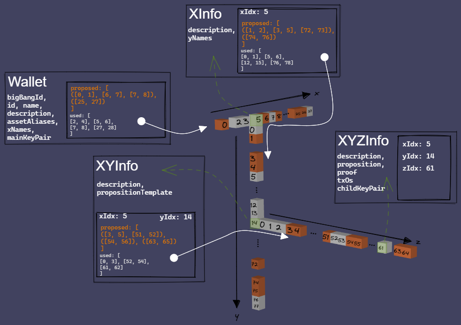

# protobuf-specs
Protobuf specifications and definitions representing blockchain data types and communication channels.

## Quick Start

1. Install [protoc](https://developers.google.com/protocol-buffers/docs/downloads#release-packages)
2. Run `run_protocol_compilers.cmd`

## Wallet Visualization

The following is a visualization of how the wallet will utilize a trie structure to manage chunks of used and proposed indices.

The Wallet is the top layer. Alongside additional information, it contains a list of chunks of x-layer indices that are in use. 
For example, in the diagram, chunk [5, 9] denotes that indices 5, 6, 7 and 8 are being used (have been assigned a purpose).

Alongside additional information (XInfo), each x-layer index that is in use contains its own list of chunks of xy-layer indices that are in use.
For example, in the diagram, chunk [12, 15] denotes that, for x=5, indices 12, 13, and 14 are being used (have been assigned a purpose).

Alongside additional information (XYInfo), each xy-layer index that is in use contains two lists: used and proposed. 
The `used` list contains chunks of xyz-layer indices that are in use.
For example, in the diagram, chunk [61, 62] denotes that, for x=5 and y=14, index 61 is being used (has been exposed on the blockchain or to a third party).
The `proposed` list contains groupings of chunks of xyz-layer indices that have been proposed to be exposed. Each grouping contains the indices that have been negotiated together.
For example, in the diagram, the grouping of chunks ([3, 5], [51, 52]) denotes that, for x=5 and y=14, indices 3, 4, and 51 have been proposed to be used. 
Once an index from a proposed grouping has been chosen, the other indices within the grouping can be released.
For example, if index 3 was chosen, the grouping ([3, 5], [51, 52]) is removed from the proposed list and 3 is added to the used list. 
In this case, chunk [0, 3] gets updated to [0, 4] in the used list.

Additional information only exists for xyz-layer indices that are in use (XYZInfo).