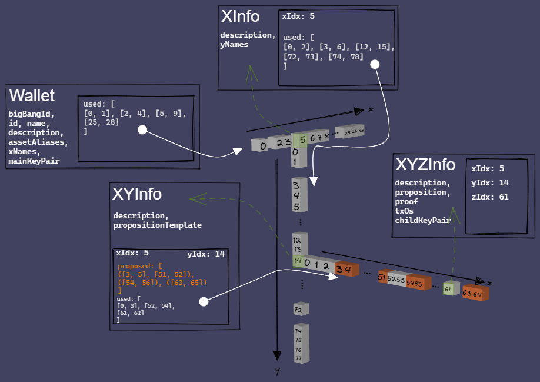

# protobuf-specs
Protobuf specifications and definitions representing blockchain data types and communication channels.

## Quick Start

1. Install [protoc](https://developers.google.com/protocol-buffers/docs/downloads#release-packages)
2. Run `run_protocol_compilers.md`

## Wallet Visualization

The following is a visualization of how the wallet will utilize a trie structure to manage chunks of used and proposed indices.

